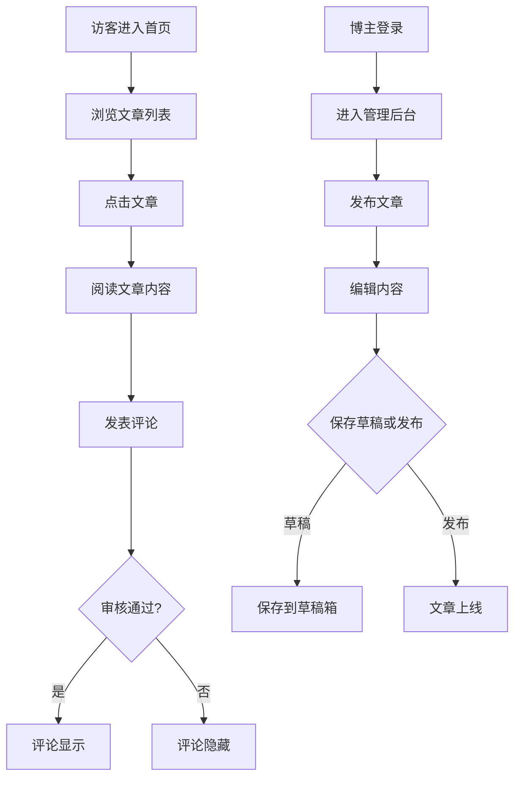

## 1. Product Overview

个人博客网站是一个功能完整的内容管理平台，旨在帮助用户发布、管理和分享文章内容，同时提供用户认证、评论互动和文章搜索等功能，为读者提供良好的阅读体验。

- 主要目的：提供一个现代化的个人博客平台，支持文章创作、用户互动和内容发现
- 目标用户：博主（内容创作者）和读者（访客）
- 市场价值：为个人创作者提供专业的内容发布平台，打造个人品牌

## 2. Core Features

### 2.1 User Roles

| Role | Registration Method | Core Permissions |
|------|---------------------|------------------|
| 访客 | 无需注册 | 浏览文章、搜索文章、提交评论（需审核） |
| 普通用户 | 邮箱注册/登录 | 浏览文章、搜索文章、评论互动、个人信息管理 |
| 管理员 | 后台配置 | 文章管理、用户管理、评论审核、系统设置 |

### 2.2 Feature Module

1. **首页**：文章列表、热门文章推荐、分类导航、搜索框
2. **文章详情页**：文章内容、阅读量、点赞、评论区、相关文章推荐
3. **文章管理页**：文章列表、发布/编辑文章、草稿管理、分类标签管理
4. **用户认证**：注册、登录、密码找回、个人信息管理
5. **评论系统**：评论列表、评论回复、评论审核、评论删除
6. **搜索功能**：按标题、内容、标签多维度搜索
7. **管理后台**：文章管理、用户管理、评论审核、系统统计

### 2.3 Page Details

| Page Name | Module Name | Feature description |
|-----------|-------------|---------------------|
| 首页 | Hero区域 | 展示最新文章或精选内容，带有渐显动画效果 |
| 首页 | 文章列表 | 卡片式布局展示文章，支持分页和筛选 |
| 首页 | 热门文章 | 侧边栏展示阅读量最高的文章 |
| 首页 | 分类导航 | 顶部导航栏展示文章分类 |
| 首页 | 搜索框 | 支持实时搜索建议 |
| 文章详情页 | 文章内容 | 富文本渲染，支持代码高亮、图片展示 |
| 文章详情页 | 阅读量统计 | 实时显示文章阅读次数 |
| 文章详情页 | 评论区 | 评论列表、评论回复、评论表单 |
| 文章详情页 | 相关文章 | 根据标签和分类推荐相关文章 |
| 文章发布页 | 富文本编辑器 | 支持Markdown或WYSIWYG编辑 |
| 文章发布页 | 分类标签 | 选择或创建文章分类和标签 |
| 文章发布页 | 草稿保存 | 自动保存草稿，支持后续编辑 |
| 用户注册/登录页 | 表单验证 | 邮箱格式验证、密码强度要求 |
| 用户注册/登录页 | 错误提示 | 友好的错误提示信息 |
| 个人中心 | 信息管理 | 修改头像、昵称、简介等 |
| 管理后台 | 仪表盘 | 数据统计、快捷操作 |
| 管理后台 | 文章管理 | 文章列表、审核、删除、批量操作 |
| 管理后台 | 用户管理 | 用户列表、权限设置 |
| 管理后台 | 评论管理 | 评论审核、删除 |

## 3. Core Process

### 3.1 用户浏览流程
访客/用户进入首页 → 浏览文章列表 → 点击文章进入详情页 → 阅读文章 → 查看评论/发表评论

### 3.2 文章发布流程
登录 → 进入管理后台 → 点击发布文章 → 填写标题和内容 → 选择分类和标签 → 保存草稿或发布

### 3.3 评论流程
访客/用户发表评论 → 评论进入待审核状态 → 管理员审核通过 → 评论显示在文章详情页

## 4. User Interface Design

### 4.1 Design Style

- **主色调**：深蓝色系（#1e3a5f）搭配温暖橙色（#f97316）作为强调色
- **辅助色**：浅灰色（#f8fafc）背景，深灰色（#1e293b）文字
- **按钮风格**：圆角矩形（border-radius: 8px），渐变背景，悬停时有轻微缩放效果
- **字体**：标题使用 'Playfair Display' 衬线字体，正文使用 'Inter' 无衬线字体
- **布局风格**：卡片式布局，清晰的视觉层次，适当的留白
- **图标风格**：使用 Lucide 图标库，简洁现代

### 4.2 Page Design Overview

| Page Name | Module Name | UI Elements |
|-----------|-------------|-------------|
| 首页 | Hero区域 | 大标题渐变文字效果，背景使用深色渐变，渐显动画 |
| 首页 | 文章卡片 | 圆角卡片、阴影效果、悬停放大、图片封面 |
| 首页 | 热门文章 | 侧边栏列表，带阅读量图标 |
| 首页 | 搜索框 | 圆角输入框，搜索图标，下拉建议 |
| 文章详情页 | 文章内容 | 宽屏布局，行高1.8，适当间距 |
| 文章详情页 | 评论区 | 嵌套评论展示，头像+用户名+时间 |
| 文章详情页 | 相关文章 | 横向滚动卡片列表 |
| 管理后台 | 侧边栏 | 固定导航，图标+文字，高亮当前项 |
| 管理后台 | 表格 | 简洁表格，支持排序和筛选 |

### 4.3 Responsiveness

- **桌面端（≥1200px）**：三栏布局，左侧文章列表，右侧边栏展示热门文章和分类
- **平板端（768px-1199px）**：两栏布局，文章列表占据主要空间
- **移动端（<768px）**：单栏布局，导航栏变为汉堡菜单，卡片堆叠展示

### 4.4 Animation Effects

- 页面加载时的渐显动画（fade-in）
- 文章卡片悬停时的缩放效果（scale）
- 导航栏滚动时的背景变化
- 评论提交时的滑入动画
- 阅读进度条滚动显示
