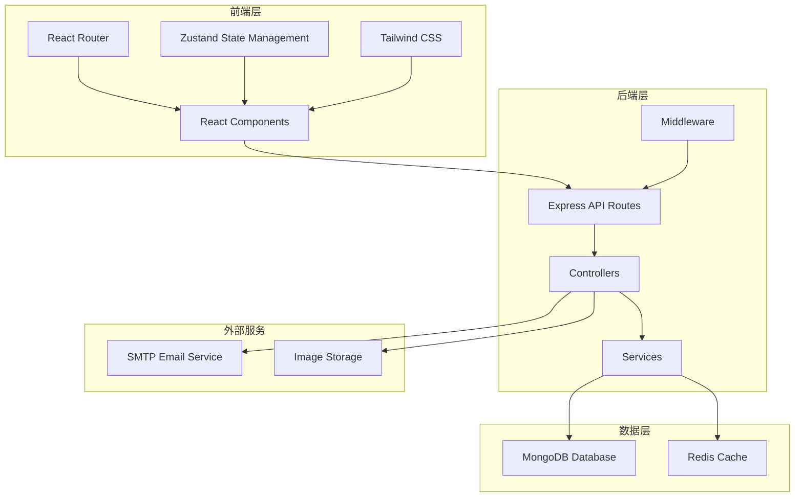
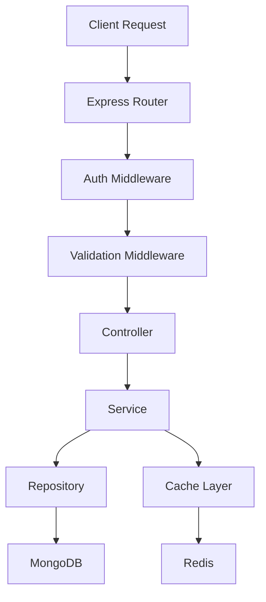
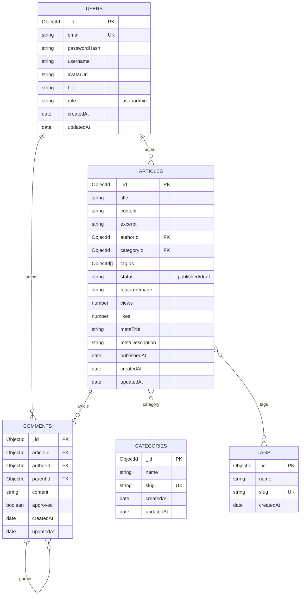

## 1. Architecture Design



## 2. Technology Description

- **Frontend**: React@18 + TypeScript + TailwindCSS@3 + Vite
- **Routing**: React Router DOM@6
- **State Management**: Zustand
- **Icons**: Lucide React
- **Rich Text Editor**: TipTap
- **Backend**: Express@4 + TypeScript
- **Database**: MongoDB + Mongoose ODM
- **Authentication**: JWT (JSON Web Tokens)
- **Password Hashing**: bcrypt
- **Validation**: Zod
- **Cache**: Redis (optional, for session storage)
- **Image Processing**: Sharp
- **Email Service**: Nodemailer
- **Initialization Tool**: vite-init

## 3. Route Definitions

### Frontend Routes

| Route | Purpose | Protected |
|-------|---------|-----------|
| / | 首页 | 否 |
| /articles/:id | 文章详情页 | 否 |
| /articles/category/:slug | 分类文章列表 | 否 |
| /articles/tag/:slug | 标签文章列表 | 否 |
| /search?q=keyword | 搜索结果页 | 否 |
| /login | 登录页 | 否 |
| /register | 注册页 | 否 |
| /profile | 个人中心 | 是 |
| /admin | 管理后台首页 | 是 (Admin) |
| /admin/articles | 文章管理 | 是 (Admin) |
| /admin/articles/new | 发布文章 | 是 (Admin) |
| /admin/articles/:id/edit | 编辑文章 | 是 (Admin) |
| /admin/comments | 评论管理 | 是 (Admin) |
| /admin/users | 用户管理 | 是 (Admin) |
| /admin/settings | 系统设置 | 是 (Admin) |

### Backend API Routes

| Route | Method | Purpose | Protected |
|-------|--------|---------|-----------|
| /api/auth/register | POST | 用户注册 | 否 |
| /api/auth/login | POST | 用户登录 | 否 |
| /api/auth/logout | POST | 用户登出 | 是 |
| /api/auth/me | GET | 获取当前用户 | 是 |
| /api/auth/refresh | POST | 刷新Token | 是 |
| /api/articles | GET | 获取文章列表 | 否 |
| /api/articles/:id | GET | 获取文章详情 | 否 |
| /api/articles | POST | 发布文章 | 是 |
| /api/articles/:id | PUT | 更新文章 | 是 |
| /api/articles/:id | DELETE | 删除文章 | 是 |
| /api/articles/:id/views | POST | 增加阅读量 | 否 |
| /api/articles/:id/likes | POST | 点赞文章 | 是 |
| /api/categories | GET | 获取分类列表 | 否 |
| /api/categories | POST | 创建分类 | 是 (Admin) |
| /api/categories/:id | PUT | 更新分类 | 是 (Admin) |
| /api/categories/:id | DELETE | 删除分类 | 是 (Admin) |
| /api/tags | GET | 获取标签列表 | 否 |
| /api/tags | POST | 创建标签 | 是 (Admin) |
| /api/tags/:id | DELETE | 删除标签 | 是 (Admin) |
| /api/comments | GET | 获取评论列表 | 否 |
| /api/comments | POST | 提交评论 | 是 |
| /api/comments/:id | PUT | 更新评论 | 是 |
| /api/comments/:id | DELETE | 删除评论 | 是 |
| /api/comments/:id/approve | POST | 审核评论 | 是 (Admin) |
| /api/search | GET | 搜索文章 | 否 |
| /api/users | GET | 获取用户列表 | 是 (Admin) |
| /api/users/:id | GET | 获取用户详情 | 是 |
| /api/users/:id | PUT | 更新用户信息 | 是 |
| /api/users/:id | DELETE | 删除用户 | 是 (Admin) |
| /api/statistics | GET | 获取统计数据 | 是 (Admin) |
| /api/sitemap | GET | 生成Sitemap | 否 |

## 4. API Definitions

### 4.1 Auth API

#### POST /api/auth/register
**Request:**
```typescript
{
  email: string;
  password: string;
  username: string;
}
```

**Response:**
```typescript
{
  success: boolean;
  message: string;
  data: {
    user: User;
    accessToken: string;
    refreshToken: string;
  };
}
```

#### POST /api/auth/login
**Request:**
```typescript
{
  email: string;
  password: string;
}
```

**Response:**
```typescript
{
  success: boolean;
  message: string;
  data: {
    user: User;
    accessToken: string;
    refreshToken: string;
  };
}
```

### 4.2 Articles API

#### GET /api/articles
**Query Params:**
```typescript
{
  page?: number;
  limit?: number;
  category?: string;
  tag?: string;
  status?: 'published' | 'draft';
}
```

**Response:**
```typescript
{
  success: boolean;
  data: {
    articles: Article[];
    pagination: {
      total: number;
      page: number;
      limit: number;
      pages: number;
    };
  };
}
```

#### POST /api/articles
**Request:**
```typescript
{
  title: string;
  content: string;
  excerpt?: string;
  categoryId: string;
  tagIds: string[];
  status: 'published' | 'draft';
  featuredImage?: string;
  metaTitle?: string;
  metaDescription?: string;
}
```

**Response:**
```typescript
{
  success: boolean;
  message: string;
  data: Article;
}
```

### 4.3 Comments API

#### POST /api/comments
**Request:**
```typescript
{
  articleId: string;
  content: string;
  parentId?: string;
}
```

**Response:**
```typescript
{
  success: boolean;
  message: string;
  data: Comment;
}
```

### 4.4 Search API

#### GET /api/search
**Query Params:**
```typescript
{
  q: string;
  type?: 'title' | 'content' | 'tag';
}
```

**Response:**
```typescript
{
  success: boolean;
  data: {
    articles: Article[];
    count: number;
  };
}
```

## 5. Server Architecture Diagram



## 6. Data Model

### 6.1 Data Model Definition



### 6.2 Data Definition Language (MongoDB)

#### Users Collection
```javascript
{
  _id: ObjectId,
  email: { type: String, required: true, unique: true },
  passwordHash: { type: String, required: true },
  username: { type: String, required: true, unique: true },
  avatarUrl: { type: String, default: '' },
  bio: { type: String, default: '' },
  role: { type: String, enum: ['user', 'admin'], default: 'user' },
  createdAt: { type: Date, default: Date.now },
  updatedAt: { type: Date, default: Date.now }
}
```

#### Articles Collection
```javascript
{
  _id: ObjectId,
  title: { type: String, required: true },
  content: { type: String, required: true },
  excerpt: { type: String, default: '' },
  authorId: { type: ObjectId, ref: 'Users', required: true },
  categoryId: { type: ObjectId, ref: 'Categories', required: true },
  tagIds: { type: [ObjectId], ref: 'Tags', default: [] },
  status: { type: String, enum: ['published', 'draft'], default: 'draft' },
  featuredImage: { type: String, default: '' },
  views: { type: Number, default: 0 },
  likes: { type: Number, default: 0 },
  likedBy: { type: [ObjectId], ref: 'Users', default: [] },
  metaTitle: { type: String, default: '' },
  metaDescription: { type: String, default: '' },
  publishedAt: { type: Date },
  createdAt: { type: Date, default: Date.now },
  updatedAt: { type: Date, default: Date.now }
}
```

#### Categories Collection
```javascript
{
  _id: ObjectId,
  name: { type: String, required: true },
  slug: { type: String, required: true, unique: true },
  createdAt: { type: Date, default: Date.now },
  updatedAt: { type: Date, default: Date.now }
}
```

#### Tags Collection
```javascript
{
  _id: ObjectId,
  name: { type: String, required: true },
  slug: { type: String, required: true, unique: true },
  createdAt: { type: Date, default: Date.now }
}
```

#### Comments Collection
```javascript
{
  _id: ObjectId,
  articleId: { type: ObjectId, ref: 'Articles', required: true },
  authorId: { type: ObjectId, ref: 'Users', required: true },
  parentId: { type: ObjectId, ref: 'Comments', default: null },
  content: { type: String, required: true },
  approved: { type: Boolean, default: false },
  createdAt: { type: Date, default: Date.now },
  updatedAt: { type: Date, default: Date.now }
}
```

## 7. Security Considerations

### 7.1 Authentication & Authorization
- JWT tokens for stateless authentication
- Access token with short expiration (15 minutes)
- Refresh token with longer expiration (7 days) stored in HTTP-only cookie
- Role-based access control (RBAC)

### 7.2 Input Validation
- Server-side validation using Zod
- Sanitize user input to prevent XSS attacks
- Rate limiting for API endpoints

### 7.3 Data Protection
- Password hashing using bcrypt (10 rounds)
- HTTPS encryption for all communications
- Sensitive data filtering in logs

### 7.4 Session Management
- Token refresh mechanism
- Logout invalidates refresh token
- CSRF protection for form submissions
